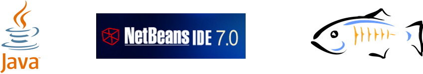

Introduction
====================================================
 
The Java EE 6 platform allows you to write enterprise and web applications using much lesser code from its earlier versions. It breaks the Ågone size fits allÅh approach with Profiles and improves on the Java EE 5 developer productivity features tremendously. Several specifications like Enterprise JavaBeans 3.1, JavaServer Faces 2.0, Java API for RESTful Web Services 1.1, Java Persistence API 2.0, Servlet 3.0, Contexts and Dependency Injection 1.0, and Bean Validation 1.0 make the platform more powerful by adding new functionality and yet keeping it simple to use. NetBeans, Eclipse, and IntelliJ provide extensive tooling for Java EE 6.

This hands-on lab will build a typical 3-tier end-to-end Web application using Java EE 6 technologies including JPA2, JSF2, EJB 3.1, JAX-RS 1.1, Servlet 3, CDI 1.0, and Bean Validation 1.0. The application is developed using NetBeans 7 and deployed on GlassFish 3.1.1.

The latest copy of this document is always available at https://blogs.oracle.com/arungupta/resource/javaee6-hol-glassfish.pdf.

Software Downloads
-------------------------------------------------------

The following software need to be downloaded and installed:

* JDK 6 or 7 from http://www.oracle.com/technetwork/java/javase/downloads/index.html.
* NetBeans 7.0.1+ "All" or "JavaEE" version from http://netbeans.org/downloads/index.html. This version includes a pre-configured GlassFish 3.1.1.

If you want to use Oracle WebLogic Server 12c for development and deployment of this  application then please follow the instructions at https://blogs.oracle.com/arungupta/resource/javaee6-hol-weblogic.pdf. 
