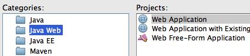
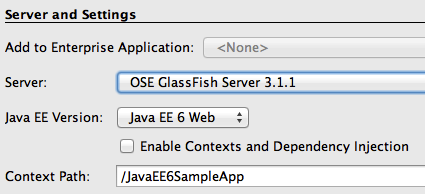
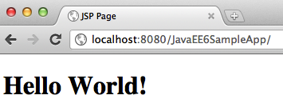
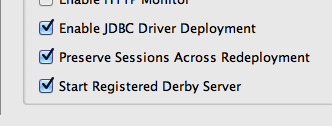

Build the Template Web Application
==============================================================

.. note::
    This section will build a template Web application using the NetBeans IDE
    
1. In NetBeans IDE, create a new Web application by selecting the "File", "New Project".
2. Choose "Java Web" as Categories and "Web Application" as Projects.

Click on "Next>".

3. Specify the project name as "JavaEE6SampleApp" and click on "Next>".

4. Choose the pre-configured GlassFish Server 3.1 as the Server. 

The actual server name may differ in your case, as in this case, if you have configured it externally. Ensure that the Java EE Version selected is "Java EE 6 Web" and click on "Finish".

This generates a template Web project. 

.. note::
    There is no web.xml in the WEB-INF folder as Java EE 6 makes it optional in most of the common cases.

5. Right-click on the project and select "Run". This will start the chosen GlassFish server, deploy the Web application on the server, opens the default web browser, and displays "http://localhost:8080/JavaEE6SampleApp/index.jsp"

The default page looks like as shown.

.. note::
    Note that even though the index.jsp is not displayed in the URL window, this is the default file that is displayed.
    
A display of this page ensures that the project is successfully created and GlassFish has started successfully as well. The GlassFish server comes bundled with the JavaDB and is pre-configured in NetBeans to start the database server as well. This can be changed by expanding the "Servers" tree in the "Services" tab, right-clicking on the chosen server,  selecting the properties, and selecting/unselecting the checkbox that says "Start Registered Derby Server".

