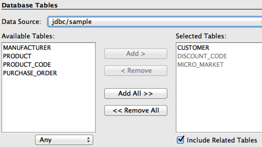

Generate JPA Entities from the Database Table
====================================================================

Java Persistence API (JPA) is a standard API that defines mapping between database tables and Java classes. These POJOs can then be used to perform all the database operations using Java Persistence Query Language (JPQL) which is a string-based SQL-like syntax or a type-safe Criteria API. Both JPQL and Criteria API operate on the Java model instead of the database tables.

.. note::
   This section will generate JPA entities from a sample database and customize them to be more intuitive for Java developers.

1. In NetBeans, right-click on  the project and select "New", "Other...", "Persistence", "Entity Classes from Database...". Choose "jdbc/sample" as the Data Source from the drop down list box as shown. This will show all the tables from this data source.

2.  Select "CUSTOMER" table from the "Available Tables" and click "Add>". Notice that the "DISCOUNT_CODE" and "MICRO_MARKET" tables are automatically selected because of the foreign key references and the selected "Include Related Tables" checkbox.

Click on "Next>".

3. Enter the package name ``org.glassfish.samples.entities`` as shown.

The database table name and the corresponding mapped class name is shown in the "Class Name" column and can be changed here, if needed.

.. note::
   Notice the following points:
    * The first check box allows NetBeans to generate multiple ``@NamedQuery`` annotations on the JPA  entity. These annotations provide pre-defined JPQL queries that can be used to query the database.
    * The second check box ensures that the ``@XmlRootElement`` annotation is generated on the JPA entity class so that it can be converted to an XML or JSON representation easily by JAXB. This feature is useful when the entities are published as a RESTful resource.
    * The third check box generates the required Persistence Unit required by JPA.

Click on "Finish" to complete the entity generation.

In NetBeans, expand "Source Packages", ``org.glassfish.samples.entities``, and double-click ``Customer.java``.

.. note::
   Notice the following points in the generated code:

    * The generated class-level ``@NamedQuery`` annotations uses JPQL to define several queries. One of the queries is named "Customer.findAll" which maps to the JPQL that retrieves all rows from the database. There are several "findBy" queries, one for each field (which maps to a column in the table), that allows to query the data for that specific field. Additional queries may be added here providing a central location for all your query-related logic.
    * The bean validation constraints are generated on each field based upon the schema definition. These constraints are then used by the validator included in the JPA implementation before an entity is saved, updated, or removed from the database.
    * The regular expression-based constraint may be used to enforce phone or zipcode in a particular format.
    * The ``zip`` and ``discountCode`` fields are marked with the ``@JoinColumn`` annotation  creating a join with the appropriate table.

Walk-through the JPA Entities and Refactor to Simplify
--------------------------------------------------------------------------------------

.. note::
   This section will customize the generated JPA entities to make them more intuitive for a Java developer.
   
1.  Edit ``Customer.java`` and change the class structure to introduce an embeddable class for ``street``, ``city``, ``country``, and ``zip`` fields as these are logically related entities. 

Replace the following code:

.. code-block:: java

    @Size(max = 30)
    @Column(name = "ADDRESSLINE1")
    private String addressline1;
    @Size(max = 30)
    @Column(name = "ADDRESSLINE2")
    private String addressline2;
    @Size(max = 25)
    @Column(name = "CITY")
    private String city;
    @Size(max = 2)
    @Column(name = "STATE")
    private String state;

and

.. code-block:: java

    @JoinColumn(name = "ZIP", referencedColumnName = "ZIP_CODE")
    @ManyToOne(optional = false)
    private MicroMarket zip;

with 

.. code-block:: java

    @javax.persistence.Embedded private Address address;
    
Click on the yellow bulb in the left bar to create a new class in the current package as shown:

.. note::
   Notice the following points:

    * The two blocks of code above are not adjacent.
    * Copy/pasting only the fields will show a red line under some of the methods in your entity but will be fixed later.
    * The ``@Embedded`` annotation ensures that this field's value is an instance of an embeddable class.

2. Change ``Address.java`` so that it is a public class, annotate with ``@Embeddable`` such that it can be used as embeddable class, and also implement the ``Serializable`` interface. The updated class definition is shown:

.. code-block:: java

    @javax.persistence.Embeddable
    public class Address implements java.io.Serializable {
    
3. In ``Address.java``, paste the different fields code replaced from ``Customer.java`` and add getter/setters for each field. The methods can be easily generated by going to the "Source", "Insert Code...", selecting "Getter and Setter...", selecting all the fields, and then clicking on "Generate".

Fix all the imports by right-clicking in the editor, selecting "Fix Imports...", and taking all the defaults.

4. Make the following changes in ``Customer.java``:

i. Remove the getter/setter for the previously removed fields.
ii. Add a new getter/setter for "address" field as:

.. code-block:: java

    public Address getAddress() { return address; }
    public void setAddress(Address address) { this.address = address; }

iii. Change the different ``@NamedQuery`` to reflect the nested structure for Address by editing the queries identified by ``Customer.findByAddressline1``, ``Customer.findByAddressline2``, ``Customer.findByCity``, and ``Customer.findByState`` such that ``c.addressline1``, ``c.addressline2``, ``c.city``, and ``c.state`` is replaced with ``c.address.addressline1``, ``c.address.addressline2``, ``c.address.city``, and ``c.address.state`` respectively.

Here is one of the updated query:

.. code-block:: java

    @NamedQuery(name = "Customer.findByCity", query = "SELECT c FROM Customer c WHERE c.address.city = :city")

iv. Change the implementation of the toString method as shown below:

.. code-block:: java

    @Override
    public String toString() {
        return name + "[" + customerId + "]";
    }

This will ensure that the customer's name and unique identifier are printed as the default string representation.
