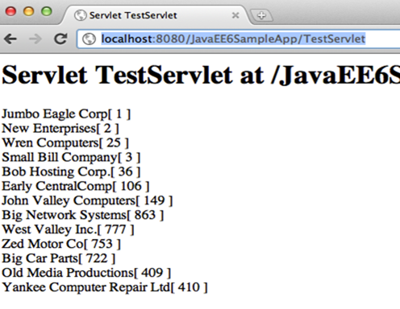

Query the Database from a Servlet
===============================================

In Java EE 6, Servlet can be easily defined using a POJO, with a single annotation, and
optional ``web.xml`` in most of the common cases.

.. note::
   This section will create a Servlet and invoke the ``@NamedQuery`` to query the database.

1. Right-click on the project, select “New”, “Servlet...”. Enter the class name as “TestServlet”,
package as ``org.glassfish.samples``, and click on “Finish”.

.. note::
   Expand “Web Pages”, “WEB-INF” and notice that no ``web.xml`` is generated for describing this Servlet as all the information is captured in the ``@WebServlet`` annotation.

.. code-block:: java

    @WebServlet(name = "TestServlet", urlPatterns = {"/TestServlet"})
    public class TestServlet extends HttpServlet {

2. Inject ``EntityManagerFactory`` in Servlet by adding the following code right after the
class declaration:

.. code-block:: java

    @PersistenceUnit EntityManagerFactory emf;

Resolve the imports by clicking on the yellow bulb

3. Add the code to use the injected ``EntityManagerFactory`` to query the database using
a pre-generated ``@NamedQuery`` to retrieve all the customers. 
The updated try block looks like:

.. code-block:: java

        try {
            out.println("<html>");
            out.println("<head>");
            out.println("<title>Servlet TestServlet</title>");  
            out.println("</head>");
            out.println("<body>");
            out.println("<h1>Servlet TestServlet at " + 
                    request.getContextPath () + "</h1>");
            List<Customer> result = (List<Customer>)emf.
                    createEntityManager().
                    createNamedQuery("Customer.findAll").
                    getResultList();
            for (Customer c : result)
                out.println(c + " ");
            out.println("</body>");
            out.println("</html>");
        } finally {

Since the Servlets are re-entrant and ``EntityManager`` is not thread safe, it needs to be
obtained from an ``EntityManagerFactory`` during each method invocation. This is resolved
when the database specific code is moved to an EJB later.
Optionally, based upon the NetBeans version,
you may have to un-comment the code in the
try block of the processRequest method by
removing the first and the last line in the try
block.

.. note::
   Notice that no transactions are started or
   committed before/after the database
   operation as this is a read-only operation and
   does not have the demands of a real-life
   application. An explicit transaction has to be
   created and committed (or rollbacked) if either
   create, update, or delete operations are
   performed. In addition, JPA2 also provides
   support for optimistic and pessimistic locking by
   means of specified locking modes.

4. Right-click in the editor pane, select “Run File”, choose the defaults, and click on OK. This
displays “http://localhost:8080/JavaEE6SampleApp/TestServlet” page in the browser and
looks like as shown.

