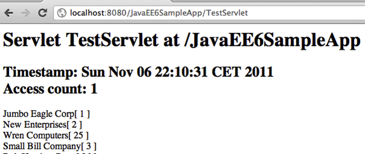
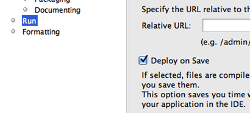
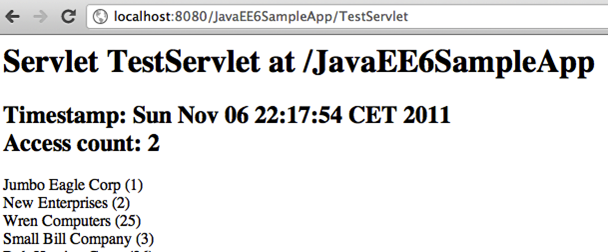
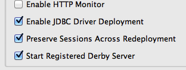

Active Redeploy to Preserve Sessions
=================================================

GlassFish provides support for preserving session state across redeployments. This feature is
called as *Active Redeploy* and works for HTTP sessions, stateful EJBs, and persistently
created EJB timers.

.. note::
   This section will show how Active Redeploy for HTTP sessions, together with NetBeans
   auto-deploy, boosts productivity for Java EE 6 application developers.

1. In ``TestServlet.java``, add the following code before the database access code:

.. code-block:: java

            int count;
            if (request.getSession().getAttribute("count") == null) {
                count = 0;
            } else {
                count = (Integer) request.getSession().getAttribute("count");
            }
            request.getSession().setAttribute("count", ++count);
            out.println("<h2>Timestamp: " + new Date() + " ");
            out.println("Times: " + request.getSession().getAttribute("count") +
                    "</h2>");

Fix the imports by taking the defaults.
This code stores a session
attribute identifying the
number of times a page has
been accessed.
Refresh the page
“http://localhost:8080/JavaEE6SampleApp/TestServlet”
in the browser to see the
output as shown.

The “Timestamp” and “Access count” is displayed on the page.

.. note:: 
The output from the Servlet may look slightly different based upon where you copy/pasted the code.

2. Edit ``Customer.java``, change the implementation of the ``toString`` method to:

.. code-block:: java

    return name + " (" + customerId + ")";

Notice, “[ “ are replaced with “ (“. Save the file.
The NetBeans IDE auto-deploys a Java EE 6
project with every file save. This can be
configured in “Project Properties”, “Run”, and by
selecting/unselecting the checkbox “Deploy on
Save” as shown.

The updated output looks like as shown.

Notice, that even though the output from the toString is correctly updated, indicating
the app was redeployed successfully, the session access count was incremented by one.
This shows that the session attributes were preserved across the redeployment.
This boosts developer's productivity because HTTP
session, which is where typically application's login
information might be stored, is not invalidated if your
application is redeployed. This is an optional feature
and can be disabled by viewing the properties of the
GlassFish server in the “Services” tab of NetBeans
and unselecting “Preserve Sessions Across
Redeployment”.

