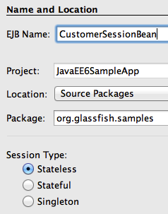
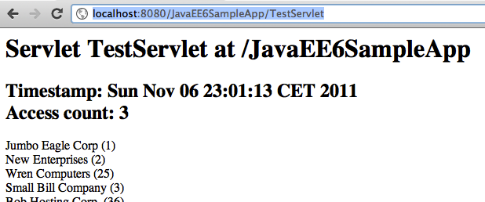

Query the Database using EJB and Refactor the Servlet
=======================================================================================

Java EE 6 provides a simplified definition and packaging for EJBs. Any POJO can be
converted into an EJB by adding a single annotation (``@Stateless``, ``@Stateful``, or
``@Singleton``). No special packaging is required for EJBs as they can be packaged in a WAR
file in the ``WEB-INF/classes`` directory.

.. note::
This section will create an EJB to query the database.

1. Create a new stateless EJB. Right-click on
“org.glassfish.samples” package, select “New”, “Session Bean...”,
specify the EJB Name as “CustomerSessionBean” as shown. Take
all the defaults, and click on “Finish”.

This will create a stateless EJB. Notice the generated EJB does
not implements an interface and this single class represents the
EJB. This is a new feature of EJB 3.1.

2. EJBs are not re-entrant and so we can inject an instance of
``EntityManager``, as opposed to ``EntityManagerFactory`` in the
Servlet, as shown:

.. code-block:: java

    @PersistenceContext
    EntityManager em;

Resolve the imports by right-clicking on the editor pane and selecting “Fix Imports”.

3. Add the following method in the EJB:

.. code-block:: java

    public List<Customer> getCustomers() {
       return (List<Customer>)em.createNamedQuery("Customer.findAll").getResultList();
    }

The implementation here is similar to the code used in the Servlet earlier.
Fix the imports.

That's all it takes to create an EJB – no deployment descriptors and no special packaging. In
this case the EJB is packaged in a WAR file.

4. The database access code in the Servlet can now be removed and all of that functionality
can be delegated to this EJB. This can be done by replacing the following code from the
Servlet:

.. code-block:: java

    @PersistenceUnit EntityManagerFactory emf;

with

.. code-block:: java

    @EJB CustomerSessionBean bean;

And replacing the following code:

.. code-block:: java

            List<Customer> result = (List<Customer>)emf.
                    createEntityManager().
                    createNamedQuery("Customer.findAll").
                    getResultList();

with

.. code-block:: java

    List<Customer> result = bean.getCustomers();

Notice how an EJB is easily injected using the ``@EJB`` annotation and is then used to invoke the
business method.

Refreshing
“http://localhost:8080/JavaEE6SampleApp/TestServlet” displays the output as shown.

This is almost the same output as shown
earlier, and that's the whole point! EJBs
are better suited for database access as all
methods are implicitly transactional. This
will be more apparent when we add code
to insert values in the database table.
Using an EJB, instead of Servlet, will not require to start and commit a transaction explicitly. 

The only difference from the previous output is the updated timestamp and the access count
has increased by 1.
