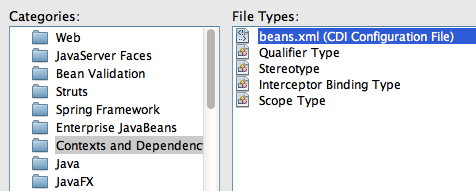
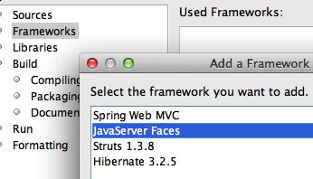
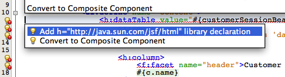

MVC using JSF2/Facelets-based view
============================================

JavaServer Faces 2 allows Facelets to be used as the view templates. This has huge benefits as Facelets are created using only XHTML and CSS and rest of the business logic is contained in the backing beans. This ensures that MVC architecture recommended by JSF can be easily achieved. The model is provided by the JPA entity, the view is served by JSF2, and controller is an EJB. Even though JSPs can still be used as view templates but Facelets are highly recommended with JSF2.

The Contexts and Dependency Injection (CDI) is a new specification in the Java EE 6 platform and bridges the gap between the transactional and the Web tier by allowing EJBs to be used as the “backing beans” of the JSF pages. This eliminates the need for any “glue code”, such as JSF managed beans, and there by further simplifying the Java EE platform.

.. note::
This section adds JSF support to the application and display the list of customers in a Facelets-based view. The EJB methods will be invoked in the Expression Language to access the database.

1. The CDI specification require beans.xml in the WEB-INF directory to enable injection of beans within a WAR file. This will allow to use the EJB in an Expression Language (EL), such as .xhtml pages that will be created later.

Right-click on the project, say “New”, “Other...”, choose “Contexts and Dependency Injection”, select “beans.xml (CDI Configuration File)” as shown.

Click on “Next>”, take all the defaults as shown.

Click on “Finish”.

This generates an empty ``beans.xml`` file in the ``WEB-INF`` folder and ensures that all POJOs in the WAR file are available for injection.

2. Add ``@javax.inject.Named`` CDI qualifier on the ``CustomerSessionBean`` class. This is a pre-defined CDI qualifier (explained later) and ensures that the EJB can now be injected in an expression language.

3. Right-click on the project, select “Properties”, “Frameworks”, “Add...”, and select “JavaServer Faces” as shown. Click on “OK”, take the default configuration, and click on “OK” again. 

With JSF 2.0 implementation in GlassFish, if any JSF-specific annotations are used in the application then the framework is automatically registered by the underlying Web container. But since our application is not using any such annotation so we have to explicitly enable it. 

Adding the framework in this case will generate a web.xml which registers the “FaceServlet” using the “/faces” URL pattern. It also generates ``index.xhtml`` page which can be verified by viewing “http://localhost:8080/JavaEE6SampleApp/faces/index.xhtml” with the output as shown.

4. JSF2 allows to create XHTML/CSS-based templates that can be used for providing a consistent look-and-feel for different pages of your website. Lets create a template first and then use it in our web page.

Right-click on the project, select “New”, “Other”, “JavaServer Faces”, “Facelets Template...”, change the name to “template”, click on “Browse...”, select the “WEB-INF” folder, and select the template as shown. Click on “Finish”.

.. note::
Notice the following points:
 * This generates ``WEB-INF/template.xhtml`` and two stylesheets in the resources/css folder. NetBeans contains a pre-defined set of templates and additional ones can be created using XHTML/CSS.
 * The ``template.xhtml`` page contains three ``
`` s with ``<ui:insert>`` named “top”, “content”, and “bottom”. These are placeholders for adding content to provide a consistent look-and-feel.
 * Its a recommended practice to keep the template pages in the WEB-INF folder to restrict their visibility to the web application.

5. In the generated ``template.xhtml``, replace the text “Top” (inside ``<ui:insert name="top">``) with:

.. code-block:: html

    <h1>Java EE 6 Sample App</h1>

and replace the text “Bottom” with (inside ``<ui:insert name="bottom">``) with:

.. code-block:: html

    
Powered by GlassFish!

The “top” and “bottom” ``
`` s will be used in other pages in our application to provide a consistent look-and-feel for the web application. The “content” ``
`` will be overridden in other pages to display the business components.

6. Now lets re-generate ``index.xhtml`` to use this template. This page, called as “client page”, will use the header and the footer from the template page and override the required ``
`` s using ``<ui:define>``. The rest of the section is inherited from the template page.

First, delete ``index.xhtml`` by right-clicking and selecting “Delete”.

Right-click on “Web Pages”, select “New”, “Other”, “JavaServer Faces” in Categories and “Facelets Template Client”... in File Types. Click on “Next>”.
Enter the file name as “index”, choose the “Browse...” button next to “Template:” text box, select “template.xhtml” as shown, and click on “Select File”.

Click on “Finish”.

.. note::
Notice the following points:
 * The generated page, ``index.xhtml``, has ``<ui:composition template='./WEB-INF/template.xhtml'>`` indicating that this page is using the template page created earlier.
 * It has three ``<ui:define>`` elements, instead of ``<ui:insert>`` in the template, with the exact same name as in the template. This allows specific sections of the template page to be overridden. The sections that are not overridden are picked up from the template.

7. Refresh “http://localhost:8080/JavaEE6SampleApp/faces/index.xhtml” to see the output as:

The output displays three sections from the ``index.xhtml`` file as generated by the NetBeans wizard.

8. In ``index.xhtml``, delete the ``<ui:define>`` element with name “top” and “bottom” as these sections are already defined in the template.

9. Replace the text “content” (inside <ui:define name="content">) with:

.. code-block:: jsp

                <h:dataTable value="#{customerSessionBean.customers}" var="c">
                    <f:facet name="header">
                        <h:outputText value="Customer Table" />
                    </f:facet>
                    
                    <h:column>
                        <f:facet name="header">Customer Name</f:facet>
                        #{c.name}
                    </h:column>
                    <h:column>
                        <f:facet name="header">Customer ID</f:facet>
                        #{c.customerId}
                    </h:column>
                </h:dataTable>            

This JSF fragment injects ``CustomerSessionBean`` into the expression language, invokes its ``getCustomers`` method, iterates through all the values, and then displays the name and id of each customer. It also displays table and column headers.

The ``f`` and ``h`` prefix used in the fragment is not referring to any namespace. This needs to be fixed by clicking on the yellow bulb as shown. Select the proposed fix. Repeat this fix for f prefix as well.

10. Refreshing the page “http://localhost:8080/JavaEE6SampleApp/faces/index.xhtml” displays the result as shown.

As you can see, the “top” and “bottom” sections are being inherited from the template and the “content” section is picked up from index.xhtml.

Additional pages can be added to this web application using the same template and thus providing consistent look-and-feel.

