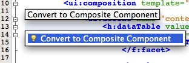
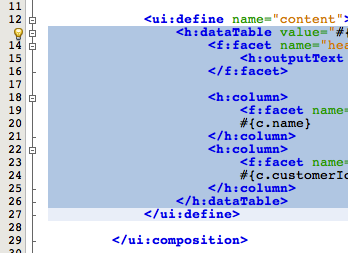
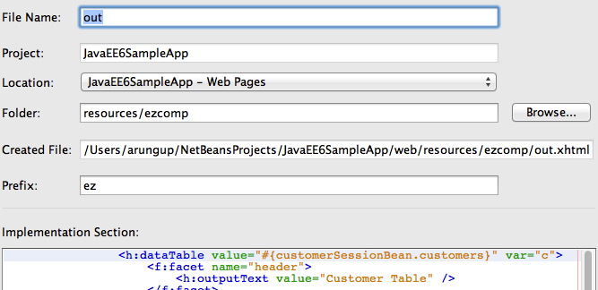

DRY using JSF2 Composite Component
============================================

The JSF2 specification defines a composite component as a component that consists of one or more JSF components defined in a Facelet markup file that resides inside a resource library. The composite component is defined in the defining page and used in the using page. The defining page defines the metadata (or parameters) using ``<cc:interface>`` and implementation using ``<cc:implementation>`` where cc is the prefix for the http://java.sun.com/jsf/composite namespace.

.. note::
This section will convert a Facelets markup fragment from ``index.xhtml`` into a composite component.

1. In ``index.xhtml``, select the ``<h:dataTable>`` fragment as shown.

Click on the yellow bulb and select the hint.

2. Take the defaults as shown.

and click on “Finish”.

The updated ``index.xhtml``, the using page, looks like:

.. code-block:: xml

    <html xmlns="http://www.w3.org/1999/xhtml"
          xmlns:ui="http://java.sun.com/jsf/facelets"
          xmlns:h="http://java.sun.com/jsf/html"
          xmlns:f="http://java.sun.com/jsf/core"
          xmlns:ez="http://java.sun.com/jsf/composite/ezcomp">
    
        <body>

            <ui:composition template="./WEB-INF/template.xhtml">

                <ui:define name="content">
                    <ez:out/>
                </ui:define>

            </ui:composition>

.. note::
It has a new namespace http://java.sun.com/jsf/composite/ezcomp with a prefix ez. This namespace is the standard namespace defined by the JSF2 specification suffixed with ``ezcomp``. This ``ezcomp`` is a new directory created in the standard resources directory defined by the JSF2 specification. The tag name for the new composite component is the same as the defining page file name. The updated directory structure looks like as shown.

The entire fragment inside ``<h:dataTable>`` is replaced with ``<ez:out>``. This allows a collection of JSF components to be extracted into a composite component following the Dont-Repeat-Yourself (DRY) design pattern and enables to use ``<ez:out>`` for printing the list of customers instead of repeating that entire code fragment. It also allows developers to author new components without any Java code or XML configuration.

The defining page ``out.xhtml`` looks like:

.. code-block:: xml

    <!-- INTERFACE -->
        <cc:interface>
        </cc:interface>
    
        <!-- IMPLEMENTATION -->
        <cc:implementation>
            <h:dataTable value="#{customerSessionBean.customers}" var="c">
                <f:facet name="header">
                    <h:outputText value="Customer Table" />
                </f:facet>
    
                <h:column>
                    <f:facet name="header">Customer Name</f:facet>
                    #{c.name}
                </h:column>
                <h:column>
                    <f:facet name="header">Customer ID</f:facet>
                    #{c.customerId}
                </h:column>
            </h:dataTable>            
    
        </cc:implementation>
    </html>

The ``<cc:interface>`` defines metadata that describe the characteristics of this component, such as supported attributes, facets, and even attach points for event listeners. ``<cc:implementation>`` contains the markup substituted for the composite component, ``<h:dataTable>`` fragment from index.xhtml in this case.

The ``<cc:interface>`` is generated in the page but is empty and may be made option in a subsequent release of the JSF specification.

Refreshing “http://localhost:8080/JavaEE6SampleApp/faces/index.xhtml” shows the same result as before.

Note: In some unknown cases you may have to deploy the project explicitly otherwise h namespace prefix in ``out.xhtml`` is not resolved correctly.
