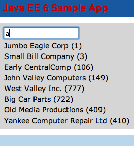
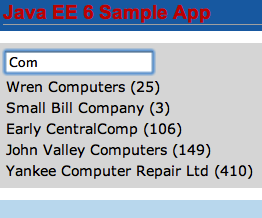
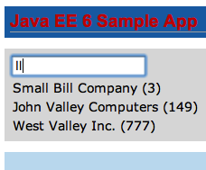

Declarative Ajax to Retrieve Partial Values from the database
===================================================================

The JSF2 specification provides standard support for Ajax. It exposes a standard JavaScript API primarily targeted for use by frameworks as well as the JSF implementation itself. It also provides a declarative approach that is more convenient for page authors.

.. note::
This section will create a new Facelet page to retrieve the list of customers from the database as their name is typed in the input box using the declarative ``<f:ajax>``. It will also show how only some elements of the page can be refreshed, aka partial page refresh.

1. Create a new Facelets Client Page by right-clicking on the project, select “New”, “Facelets Template Client ...”, give the file name as “list”, select the template “WEB-INF/template.xhtml”, take all other defaults and click on “Finish”.

2. Remove the ``<ui:define>`` elements with name “top and “bottom”.

3. Replace the code in ``<ui:define>`` element with “content” name to:

.. code-block:: xml

    <h:form>
            <h:inputText value="#{customerName.value}">
                    <f:ajax event="keyup" render="custTable"
                            listener="#{customerSessionBean.matchCustomers}"/>
            </h:inputText>
            <h:dataTable var="c" value="#{customerSessionBean.cust}" id="custTable">
                    <h:column>#{c}</h:column>
            </h:dataTable>
    </h:form>

This code displays an input text box and binds it to the “value” property of “CustomerName” bean (to be defined later). The ``<f:ajax>`` tag attaches Ajax behavior to the input text box. The meaning of each attribute is explained in the table below:

+-------------+-----------------------------------------------------------------------------------------------------------------------------------------+
| Attribute   | Purpose                                                                                                                                 |
+=============+=========================================================================================================================================+
| event       | Event of the applied component for which the Ajax action is fired, ``onkeyup`` in this case.                                            |
+-------------+-----------------------------------------------------------------------------------------------------------------------------------------+
| render      | List of components that will be rendered after the Ajax action is complete. This enables “partial page rendering”.                      |
+-------------+-----------------------------------------------------------------------------------------------------------------------------------------+
| listener    | Method listening for the Ajax event to be fired. This method must take ``AjaxBehaviorEvent`` as the only parameter and return a void.   |
+-------------+-----------------------------------------------------------------------------------------------------------------------------------------+

The ``<h:dataTable>`` is the placeholder for displaying the list of customers.

Make sure to fix the namespace/prefix mapping for h and f by clicking on the yellow bulb in the left side bar.

Note that the partial view is still rendered on the server. The updated portion is sent to the browser where the DOM is updated.

4. Add a new Java class by right-clicking on the project, selecting “New”, “Java Class...”, give the name as “CustomerName”. Change the code to:

.. code-block:: java

    @Model
    public class CustomerName {
        private String value;
    
        public String getValue() {
            return value;
        }
    
        public void setValue(String value) {
            this.value = value;
        }
    }

The ``@Model`` annotation is a CDI stereotype that is a simplified way of saying that the bean is both ``@Named`` and ``@RequestScoped``. A handful of stereotypes are already pre-defined in the CDI specification and new ones can be easily defined.

Its important to mark this bean request-scoped otherwise a new instance of this bean is created for every injection request.

5. Add the following method to ``CustomerSessionBean.java``:

.. code-block:: java

    public void matchCustomers(AjaxBehaviorEvent evt) {
        CriteriaBuilder builder = em.getCriteriaBuilder();
        CriteriaQuery criteria = builder.createQuery(Customer.class);
        // FROM clause
        Root root = criteria.from(Customer.class);

        // SELECT clause
        criteria.select(root);

        // WHERE clause
        Predicate condition = builder.like(root.get(Customer_.name),
                "%" + name.getValue() + "%");
        criteria.where(condition);

        // FIRE query
        TypedQuery query = em.createQuery(criteria);

        // PRINT result
        cust = query.getResultList();
    }

.. note::
This method is similar to ``getCustomers2`` added earlier. The two differences are:

 * The method takes ``AjaxBehaviorEvent`` as the parameter as this is requirement for the listener attribute of ``<f:ajax>``.

 * The Criteria query specifies a WHERE clause using the JPA2 metamodel that was generated earlier. The clause narrows down the search results where the customer's name consists of the string mentioned in the input text box.

Fix the imports. Make sure ``javax.persistence.criteria.Predicate`` class is imported, this is not the default.

6. Inject the customer name as:

.. code-block:: java

    @Inject CustomerName name;

And resolve the import again by taking defaults.

7. Add a new field as:

.. code-block:: java

    private List<Customer> cust;
    
    This field is used to return the partial list of customers meeting the criteria. Add a getter for it as:
    
        public List<Customer> getCust() {
            return cust;
        }

8. Save all the files and open “http://localhost:8080/JavaEE6SampleApp/faces/list.xhtml” in the browser. The default output looks very familiar as shown.

This is because no criteria is specified in the text and so the complete list is shown.

If you type “a” in the text box then the list of customers is narrowed down to the names that contain “a” as shown. Some other sample results are shown as well.

Notice, all of this is only refreshing the ``<h:dataTable>`` and there by showing “partial page refresh” or “partial page rendering”.

