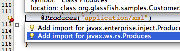
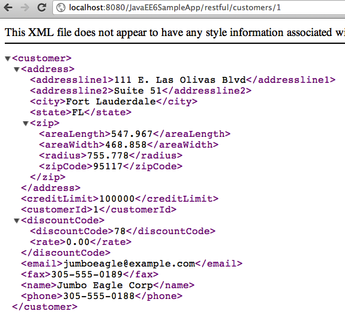
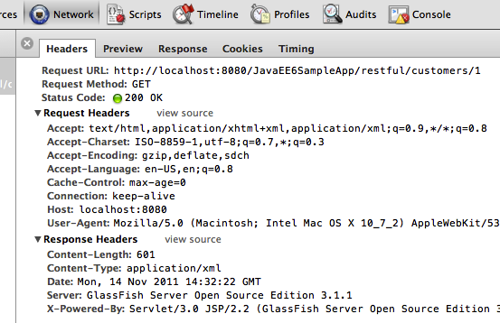

Publish EJB as a RESTful Resource using JAX-RS
=================================================

The JAX-RS 1.1 specification defines a standard API to provide support for RESTful Web services in the Java platform. Just like other Java EE 6 technologies, any POJO can be easily converted into a RESTful resource by adding the @Path annotation. JAX-RS 1.1 allows an EJB to be published as a RESTful entity.

.. note::
This section publishes an EJB as a RESTful resource. A new method is added to the EJB which will be invoked when the RESTful resource is accessed using the HTTP GET method.

1. In ``CustomerSessionBean.java``, add a class-level @Path annotation to publish EJB as a RESTful entity. The updated code looks like:

.. code-block:: java

    @Stateless
    @LocalBean
    @Named
    @Path("/customers")
    public class CustomerSessionBean {

The new annotation is highlighted in bold. Resolve the imports by clicking on the yellow bulb and selecting ``javax.ws.rs.Path``.

The window shown on the right pops up as soon as you save this file.

The “REST Resources Path” is the base URI for servicing all requests for RESTful resources in this web application. The default value of “/resources” is already used by the .xhtml templates and CSS used by JSF. So change the value to “/restful” and click on “OK”.

Notice that a new class that extends ``javax.ws.rs.core.Application`` is generated in the org.netbeans.rest.application.config package. This class registers the base URI for all the RESTful resources provided by @Path. The updated base URI is “restful” as can be seen in the generated class.

2. Add the following method to ``CustomerSessionBean.java``:

.. code-block:: java

    @GET
    @Path("{id}")
    @Produces("application/xml")
    public Customer getCustomer(@PathParam("id")Integer id) {
        return (Customer)em.createNamedQuery("Customer.findByCustomerId").setParameter("customerId", id).getSingleResult();
    }

This method is invoked whenever the REST resource is accessed using HTTP GET and the expected response type is XML. 

.. note::
 Notice the following points:
 * The @GET annotation ensures that this method is invoked when the resource is accessed using the HTTP GET method.
 * The @Path(“{id}”) defines a sub-resource such that the resource defined by this method can be accessed at customers/{id} where “id” is the variable part of the URI and is mapped to the “id” parameter of the method as defined by @PathParam annotation.
 * The @Produces annotation ensures that an XML representation is generated. This will work as @XmlRootElement annotation is already added to the generated entity.

Fix the imports by taking the default values for all except for @Produces. This annotation needs to be resolved from the javax.ws.rs package as shown.

3. The RESTful resource is now accessible using the following format:

http://<HOST>:<PORT>/ <CONTEXT-ROOT>/<RESOURCE-BASE-URI>/<RESOURCE-URI>/<SUB-RESOURCE-URI>/<VARIABLE-PART>

The <CONTEXT-ROOT> is the context root of the web application. The <SUB-RESOURCE-URI> may be optional in some cases. The <VARIABLE-PART> is the part that is bound to the parameters in Java method.

In our case, the URI will look like:

http://localhost:8080/JavaEE6SampleApp/restful/customers/{id} where {id} is the customer id shown in the JSF page earlier. So accessing “http://localhost:8080/JavaEE6SampleApp/restful/customers/1” in a browser displays the output as shown.

Accessing this URI in the browser is equivalent to making a GET request to the service. This can be verified by viewing the HTTP headers generated by the browsers as shown (“Tools”, “Developer Tools” in Chrome).

4. Each resource can be represented in multiple formats. Change the ``@Produces`` annotation in  ``CustomerSessionBean.java`` from:

.. code-block:: java

    @Produces("application/xml")

to

.. code-block:: java

    @Produces({"application/xml", "application/json"})

This ensures that an XML or JSON representation of the resource can be requested by a client. This can be easily verified by giving the following command (shown in bold) on a command-line:

.. code-block::

    curl -H "Accept: application/json" http://localhost:8080/JavaEE6SampleApp/restful/customers/1 -v
    * About to connect() to localhost port 8080 (#0)
    *   Trying ::1... connected
    * Connected to localhost (::1) port 8080 (#0)
    > GET /JavaEE6SampleApp/restful/customers/1 HTTP/1.1
    > User-Agent: curl/7.21.4 (universal-apple-darwin11.0) libcurl/7.21.4 OpenSSL/0.9.8r zlib/1.2.5
    > Host: localhost:8080
    > Accept: application/json
    >
    < HTTP/1.1 200 OK
    < X-Powered-By: Servlet/3.0 JSP/2.2 (GlassFish Server Open Source Edition 3.1.1 Java/Apple Inc./1.6)
    < Server: GlassFish Server Open Source Edition 3.1.1
    < Content-Type: application/json
    < Transfer-Encoding: chunked
    < Date: Tue, 08 Nov 2011 14:45:52 GMT
    <
    * Connection #0 to host localhost left intact
    * Closing connection #0
    {"address":{"addressline1":"111 E. Las Olivas Blvd","addressline2":"Suite 51","city":"Fort Lauderdale","state":"FL","zip":{"areaLength":"547.967","areaWidth":"468.858","radius":"755.778","zipCode":"95117"}},"creditLimit":"100000","customerId":"1","discountCode":{"discountCode":"78","rate":"0.00"},"email":"jumboeagle@example.com","fax":"305-555-0189","name":"Jumbo Eagle Corp","phone":"305-555-0188"}

.. note::
Notice the following points:
 * The command is shown in the bold letters.
 * Connection handshake is pre-fixed “*”.
 * The HTTP request headers are pre-fixed with “>” and response headers with “<”.
•	The response in JSON format is at the end of the message.

The “curl” utility for Windows-based machines can be downloaded from: http://curl.haxx.se/.

