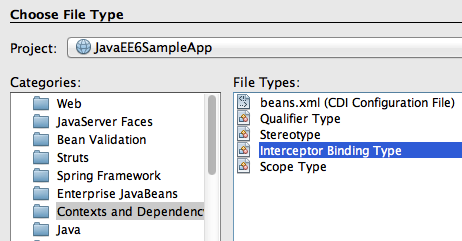
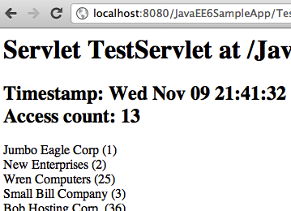

Cross-cutting Concerns using CDI Interceptors
=======================================================

The Interceptors do what they say – they intercept on invocation and lifecycle events on an associated target class. They are used to implement cross-cutting concerns like logging and auditing. The Interceptors specification is extracted from the EJB specification into a new specification so that they can more generically applied to a broader set of specifications.

The CDI specification enhances the basic functionality by providing an annotation-based approach to binding interceptors to beans. The target class may specify multiple interceptors thus forming a chain of interceptors.

.. note::
This section will explain how to add an interceptor that intercepts all the business method invocations and logs them.

1. Right-click on the project, select “New”, “Other...”, “Contexts and Dependency Injection”, “Interceptor Binding Type” as shown.

Click on “Next>”.

2. Give the class name as “Logging” and choose the package name as “org.glassfish.samples”, and click on “Finish”.

This defines the interceptor binding type which is specified on the target class. This binding can have multiple implementations which can be enabled or disabled at deployment using ``beans.xml``.

The generated binding consists of the following code:

.. code-block:: java

    @Inherited
    @InterceptorBinding
    @Retention(RUNTIME)
    @Target({METHOD, TYPE})
    public @interface Logging {
    }

3. Implement (or bind) the interceptor by creating a POJO class and naming it “LoggingInterceptor”. Change the class definition to:

.. code-block:: java

    @Interceptor
    @Logging
    public class LoggingInterceptor {
    
        @AroundInvoke
	public Object intercept(InvocationContext context) throws Exception {
            System.out.println("BEFORE: " + context.getMethod());
            Object result = context.proceed();
            System.out.println("AFTER: " + context.getMethod());
    
            return result;
        }
    }

Resolve the imports.

.. note::
Notice the following points in the code:

 * This class has the ``@Logging`` annotation which is the binding type generated earlier.
 * It has the @Interceptor annotation marking this class to be an interceptor implementation.
 * The @AroundInvoke annotation defines the method that will intercept the business method invocation on the target class and require the signature as shown in the code. An interceptor implementation cannot have more than one ``@AroundInvoke`` method.
 * The InvocationContext parameter provides information about the intercepted invocation and provide operations to control the behavior of the chain invocation.
 * This method prints a log message, with the name of the business method being invoked, before and after the business method execution.

4. The interceptors may be specified on the target class using the ``@Interceptors`` annotation which suffers from stronger coupling to the target class and not able to change the ordering globally. The recommended way to enable interceptors is by specifying them in beans.xml. 

Add the following fragment to beans.xml to enable the interceptor:

.. code-block:: xml

    <interceptors>
        <class>org.glassfish.samples.LoggingInterceptor</class>
    </interceptors>

5. The interceptors may be specified at a class- or a method-level. Lets intercept all invocations of the ``getCustomers2`` method in ``CustomerSessionBean.java``. This can be done by adding the following annotation right above the method:

@Logging

This is the same binding type that we created earlier.

6. Access the URL  “http://localhost:8080/JavaEE6SampleApp/TestServlet” in a browser which invokes ``CustomerSessionBean.getCustomers2`` method and displays the output as shown. This is very similar output as we've seen earlier.

The interesting part is shown in the GlassFish log as shown:

.. code-block:: 

    INFO: BEFORE: public java.util.List org.glassfish.samples.CustomerSessionBean.getCustomers2()
    INFO: AFTER: public java.util.List org.glassfish.samples.CustomerSessionBean.getCustomers2()

It shows “BEFORE” and “AFTER” string along with the business method name and return type. These statements are printed from the interceptor implementation.
