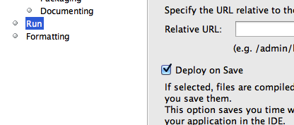
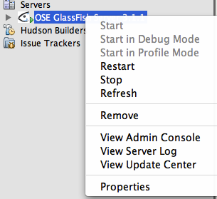
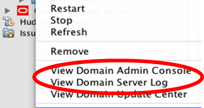

Troubleshooting
======================

1. The project is getting deployed to GlassFish every time a file is saved. How can I disable/enable that feature ?

This feature can be enabled/disable per project basis from the Properties window. Right-click on the project, select “Properties”, choose “Run” categories and select/unselect the checkbox “Deploy on Save” to enable/disable this feature.

2. How can I show the SQL queries issued to the database ?

In NetBeans IDE, expand “Configuration Files”, edit “persistence.xml” and replace:

.. code-block:: xml

    <properties/>

with

.. code-block:: xml

    <properties>
        <property name="eclipselink.logging.level" value="FINE" />
    </properties>

3. How can I start/stop/restart GlassFish from within the IDE ?

In the “Services” tab, right-click on “GlassFish Server 3.1”. All the commands to start, stop, and restart are available from the pop-up menu. The server log can be viewed by clicking on “View Server Log” and web-based administration console can be seen by clicking on “View Admin Console”.

4. How to recreate the NetBeans sample database ?

 i. Find the location of database in “Services” tab of NetBeans, right-clicking on “JavaDB”. The default location is .netbeans-derby in your home directory. Close NetBeans and delete this directory.
 ii. Remove .netbeans directory in your home directory.
 iii. Start NetBeans and the database will be recreated and new records will deployed into Sample database.

5. I accidentally closed the GlassFish output log window. How do I bring it back ?

In “Services” tab of NetBeans, expand “Servers”, choose the GlassFish node, and select “View Domain Server Log”.

6. The method with ``@Schedule`` are not printing the output on desired intervals.

The GlassFish output window may be showing the following log message:

.. code-block:: xml

    keepstate is true and will not create new auto timers during deployment.

This can be fixed if you right-click on the project and select “Deploy”, right-click again now select “Run”.

7. The namespace prefix for the composite component is not getting resolved.

This may happen if the namespace prefix was manually specified during the composite component creation. In this case you need to add the following namespace prefix mapping to the .xhtml document:

.. code-block:: xml

    xmlns:ez="http://java.sun.com/jsf/composite/ezcomp"

8. I clicked Cancel when the wizard for specifying the base URL for the RESTful resources showed. How do I generate the class now ?

Right-click on “org.glassfish.samples” package, select “New”, “Java Class...”, specify the name as “ApplicationConfig”. Change the generated source code to:

.. code-block:: java

    @javax.ws.rs.ApplicationPath("webresources")
        public class ApplicationConfig extends javax.ws.rs.core.Application {
    }

9. The database server is not getting started.

Here are a few items to check for:
 * In “Services” tab, right-click on “JavaDB” and click on Properties. It shows the location of JavaDB and the directory where the sample database is installed. Make sure both the directories exist.
 * Manually start the database by right-clicking on “JavaDB” and selecting “Start Server”.
 * Refer to 20.4 if the sample database has no records.
